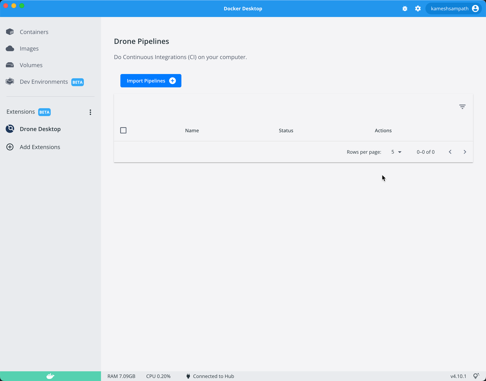

## Overview

By the end of this chapter you will be able to,

- [x] Understand the structure of `.drone.yml`
- [x] Create your first Drone pipeline
- [x] Run your Drone pipeline using `drone` CLI
- [ ] Run your drone pipeline using Drone Desktop {== TODO ==}
- [x] Build and push a container image to local container registry
- [x] Using environment variables with pipelines
- [x] Using secrets with pipelines
- [x] Understanding Plugins and Services
- [x] Mounting Volumes from the Docker host

## Ensure Environment

Before getting started let us ensure we have the requried tools on our path

### Drone

```shell
drone --version
```

The command should show an output like `v1.5.0`.

### Docker

```shell
docker --version
```

The command should show an output like `Docker version 20.10.16, build aa7e414`

## Your first Pipeline

In order get the feel of `drone` let us run create and run our very first pipeline.

Navigate to work folder

```shell
mkdir -p $PROJECT_HOME/work/first-pipeline
cd $PROJECT_HOME/work/first-pipeline
```

Create file `.drone.yml` with the following content,

```yaml title=".drone.yml"
---8<--- "includes/examples/first-pipeline.yaml"
```

Let us run our first pipeline,

```shell
drone exec
```

The command should run our pipeline and shown an output like,

```text
[say hello:0] + echo 'Hello World'
[say hello:1] Hello World
```

**Congratulations!**. You have successfully run your first pipeline.

Pipeline **steps** are run sequentially. Let us add another step to our pipeline as shown,

```yaml title=".drone.yml"
---8<--- "includes/examples/first-pipeline-two-steps.yaml"
```

Try running the `drone exec` command again to see the output as shown,

```text
[say hello:0] + echo 'Hello World'
[say hello:1] Hello World
[good bye:0] + echo 'Good bye'
[good bye:1] Good bye
```

## Trusted mode

Trusted mode instructs `drone` to run in trusted mode typically with extra privileges. When to use **trusted** mode ? Lets take an example of building and pushing our application as a container image to local registry. In order to do that we need:

- An application, with Dockerfile to build the container image
- A local container registry, where the built image will be pushed

As part of the tutorial we have an `$TUTORIAL_HOME/apps` folder that has various exercise sources/demos, that we will be using through out this tutorial. For this exercise we will be using  `$TUTORIAL_HOME/apps/hello-go`.

Let us navigate to that folder,

```shell
cd $TUTORIAL_HOME/apps/hello-go
```

### Deploy Local Container Registry

Before we execute the pipeline we need to start a [local container registry](https://docs.docker.com/registry/), run the following command to start one locally,

```shell
docker run -d -p 5001:5000 --name registry registry:2
```

You can verify if the registry is started using the `docker ps` command.

```shell
docker ps --filter name=registry
```

The command should return an output like,

```shell
CONTAINER ID   IMAGE        COMMAND                  CREATED          STATUS          PORTS                    NAMES
673c375aca50   registry:2   "/entrypoint.sh /etc…"   41 minutes ago   Up 41 minutes   0.0.0.0:5001->5000/tcp   registry
```

### Pipeline

Let us analyse the Drone pipeline of our app,

```yaml title=".drone.yml"
---8<--- "apps/hello-go/.drone.yml"
```

It is a simple one step pipeline that builds the go application using the *Dockerfile*:

```dockerfile title="Dockerfile"
---8<--- "apps/hello-go/Dockerfile"
```

And pushes the image to local container registry `localhost:5001` as *localhost:5001/example/hello-go*.

!!!note
    The docker build is done using Drone **Plugins**, we will talk more about it in upcoming chapters

{==**TODO:** Add more explanation ==}

But to push to the local container registry we need the handle to the docker socket of the host which is usually the file `/var/run/docker.sock`. We add the handle in our pipeline using the `volume` mounts. As we are mounting the host file into the container its expected to instruct Drone to run in **trusted** mode to add extra privileges to the step containers.

### Build Application

Build and push the image by running the command,

```shell
drone exec --trusted
```

Once the pipeline is successful, you can test the built image by running the following command,

```shell
docker run --rm -p8080:8080 localhost:5001/example/hello-go
```

Now doing a `curl localhost:8080` should return a response **Hello, World!**.

!!!note "Plugins"
    When we built the container image we used image called `plugins/docker` with custom settings what is that? It is a **Drone Plugin**.
    
    Plugins are pre-defined set of commands which is packed as a container image. Plugins are reusable and the parameters to the plugin commands are passed using *settings* block.

    Please check [Drone Plugins](https://plugins.drone.io) for a list of available plugins.

## Drone Desktop

Until now we saw how to execute the pipelines from command line. Drone Desktop is a [Docker Desktop Extension](https://docs.docker.com/desktop/extensions/) that allows you import and run pipelines from within Docker Desktop.

### Install Drone Desktop Extension

```shell
# volume used by Drone Desktop
docker volume create drone-desktop-data
docker extension install docker.io/kameshsampath/drone-desktop-extension:v1.0.3
```

If your install is successful you should see the **Drone Desktop** extension in the Docker Desktop as shown,



### Import Pipelines

You can search and import pipelines into Drone Desktop,


### Execute Pipeline

{== TODO: Update this section once we have the feature added to Drone Desktop ==}

## Including and Excluding Steps

Drone allows you to include and exclude steps of the pipeline at execution time. 

Let us navigate to the exercise folder,

```shell
cd $TUTORIAL_HOME/apps/greeting
```

Let us analyse the Drone pipeline that we will use for this exercise, it is simple greeter application that says **hello world** in multiple languages.

```yaml title=".drone.yml" hl_lines="6 11"
---8<--- "apps/greeting/.drone.yml"
```

### Include Steps

Let us assume that we want to greet in *English* and *French* i.e. run only the steps **english** and **french**. To do that run the following command,

```shell
drone exec --include=english --include=french
```

A successful run will shown an output like,

```text
[english:0] + echo hello world
[english:1] hello world
[french:0] + echo bonjour monde
[french:1] bonjour monde
```

### Exclude Steps

Excluding steps works in a similar way as that of include but with exclude we specify the steps to be excluded. Say we want to exclude **hindi** and **japanese** steps from our pipeline run, to do that run the `drone` command as shown,

```shell
drone exec --exclude=hindi --exclude=japanese
```

A successful run will shown an output like,

```text
[english:0] + echo hello world
[english:1] hello world
[french:0] + echo bonjour monde
[french:1] bonjour monde
```

## Injecting Environment Variables

In many cases we might need to load few settings from environment variables or files, `drone` provides an option called `--env-file` that allows to load the environment variable(s) which can then be used within step containers.

Let us navigate to the exercise folder,

```shell
cd $TUTORIAL_HOME/apps/env-greeting
```

Let us analyse the pipeline file,

```yaml title=".drone.yml" hl_lines="9"
---8<--- "apps/env-greeting/.drone.yml"
```

### Loading Environment Variables

As you notice the pipeline step *english* prints the value `${GREETING_MESSAGE}`. The variable `${GREETING_MESSAGE}` loaded from the file `my-env`.

```yaml title="my-env"
---8<--- "apps/env-greeting/my-env"
```

### Run Pipeline

In order for the steps to use `${GREETING_MESSAGE}` as environment variable, we use the `--env-file` option of the `drone` command to load `my-env` into the step container.

Now run the pipeline,

```shell
drone exec --env-file=my-env 
```

The pipeline execution will show an output like,

```text
[english:0] + echo $GREETING_MESSAGE
[english:1] Hello, World!
```

## Injecting Secrets

Drone also allows to load few settings from secrets, `drone` provides an option called `--secret-file` with which we can load the secrets as environment variables and use them in our steps.

!!!NOTE
    Secrets are masked in pipeline logs

Navigate to the exercise folder,

```shell
cd $TUTORIAL_HOME/apps/using-secrets
```

Let us analyse the pipeline file,

```yaml title=".drone.yml" hl_lines="15 17 19 21"
---8<--- "apps/using-secrets/.drone.yml"
```

As you have noted from the highlighted line, we inject the environment variable called `PGDATABASE` with value from secret `postgres_db` using a special `drone` attribute named **from_secret**.The **from_secret** attribute value maps to the secret key that gets loaded using `--secret-file` option.

### Loading Secrets

As you notice the pipeline step *what is today?* runs a `psql` command that selects the current date using the SQL query `SELECT NOW()`.

To `psql` command expects the environment variables:

- PGHOST
- PGPORT
- PGDATABASE
- PGUSER
- PGPASSWORD

We define *PGHOST*,*PGPORT* as plain text values in the **environment** block,  whereas *PGDATABASE*,*PGUSER*,*PGPASSWORD* are loaded from the secret file `secret.txt`.

```yaml title="secret.txt"
---8<--- "apps/using-secrets/secret.txt"
```

### Run Pipeline

Now run the pipeline,

```shell
drone exec --secret-file=secret.txt
```

The pipeline execution will show an output like ( output trimmed for brevity),

```text
...
[what is today?:1] + psql --host=$PGHOST --port=$PGPORT -w -c 'SELECT NOW() as TODAY;'
[what is today?:2]              today
[what is today?:3] -------------------------------
[what is today?:4]  2022-07-19 06:48:05.497789+00
[what is today?:5] (1 row)
[what is today?:6]
...
```

!!!IMPORTANT
    For this demo we add the secret.txt git, but for production scenarios make sure the file name or pattern is added to `.gitingore`

## Multiple Pipelines or Stages

A `drone` pipeline `.drone.yml` can have multiple pipelines a.k.a **stages**. EAch stage is its own YAML document. The `drone` command has an option called `--pipeline` that allows you to invoke the required stage,

Let us navigate to the exercise folder,

```shell
cd $TUTORIAL_HOME/apps/multiple-stages
```

As you see form the pipeline file, it has four stages namely *english,french,hindi and japanese*.

```yaml title=".drone.yml"
---8<--- "apps/multiple-stages/.drone.yml"
```

### Run a Stage

Let us say you want to run the *japanese* stage of the pipeline,

```shell
drone exec --pipeline=japanese
```

The command should shown an output like,

```text
[greeting:0] + echo こんにちは世界
[greeting:1] こんにちは世界
```

!!!note "Services"

    As you noticed we used new configuration block in the pipline called *services*. Services are detached containers that are not part of your step but will be used by steps. These containers are killed automatically after the pipeline execution ends.

## Exchange Information Between Steps

The pipeline does not run independently, each step produces some output that may be used by the next step(s). The easiest way to exchange information between steps is using Volume mounts,

Navigate to the exercise folder `$TUTORIAL_HOME/apps/exchange-info`,

Let us check the pipeline file,

```yaml title=".drone.yml" hl_lines="10-12 17-19"
---8<--- "apps/exchange-info/.drone.yml"
```

As you noticed both the steps *store-message* and *show-message* mounts a Volume on same path `/data`. The *store-message* writes an output to the file `/data/message.txt` which is then read and displayed by the next step *show-message*.

Run the pipeline to see it in action,

```shell
drone exec
```

A successful pipeline execution will show the following output,

```text
[store-message:0] + echo 'Hello, World!' > /data/message.txt
[show-message:0] + cat /data/message.txt
[show-message:1] Hello, World!
```

Navigate back to `$TUTORIAL_HOME` before starting to work on the next set of exercises.

```shell
cd $TUTORIAL_HOME
```
